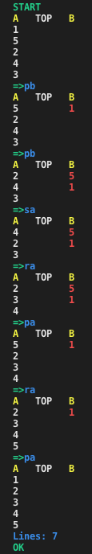

# 42-push_swap

## Goal

The Push_swap project is a very simple and highly effective algorithm project: data will
need to be sorted. You have at your disposal a set of int values, 2 stacks and a set of
instructions to manipulate both stacks.  

This project includes 2 programs in C:  
• The first, named **checker** which takes integer arguments and reads instructions on
the standard output. Once read, checker executes them and displays OK if integers
are sorted. Otherwise, it will display KO.  
• The second one called **push_swap** which calculates and displays on the standard
output the smallest progam using Push_swap instruction language that sorts integer arguments received.  

• The goal is to sort in ascending order numbers into stack a.  
• To do this you have the following operations at your disposal:  
**sa** : swap a - swap the first 2 elements at the top of stack a. Do nothing if there
is only one or no elements).  
**sb** : swap b - swap the first 2 elements at the top of stack b. Do nothing if there
is only one or no elements).  
**ss** : sa and sb at the same time.  
**pa** : push a - take the first element at the top of b and put it at the top of a. Do
nothing if b is empty.  
**pb** : push b - take the first element at the top of a and put it at the top of b. Do
nothing if a is empty.  
**ra** : rotate a - shift up all elements of stack a by 1. The first element becomes
the last one.  
**rb** : rotate b - shift up all elements of stack b by 1. The first element becomes
the last one.  
**rr** : ra and rb at the same time.  
**rra** : reverse rotate a - shift down all elements of stack a by 1. The last element
becomes the first one.  

## My solution and results

I used linked list implementation to form stacks and for storing the rules.

I have three different algorithms for different amount of integers:

**sort_three**: Sorts three integers less than 3 moves. This was quite simple because there was only 3 X 2 different combinations.      
**sort_five**: Sorts five integers in less than 11 moves. Best case is 7 moves (see the example). This algorithm finds the lowest number that is pushed to stack B following the next integer that is also pushed to stack B. After that I can use sort_three to solve stack A and push lowest number from stack B back to A. Then I have to find the right spot for the last number and put in place.  
**big_sort**: This algorithm is designed for larger amount of integers. This algorithm splits stack A into smaller chunks which are pushed to stack B: <= 100 are splitted into 5 chunks and > 100 integers into 10 chunks. Smaller chunks are pushed first to stack B. I used sorted array of integers to help me to split stack A. When all of the numbers are in the stack B then I can start to search numbers from biggest number and push them back to stack A. This continues until B is empty and A is sorted. For optimizing I created a function called shortest way to check is it more effective to use rb or rrb to get that number on top of the stack B. This algorithm sorts 100 integers in ~700 moves and 500 in ~7000 moves.

## Compiling and Usage

Run **make** from terminal and use command:  
``./push_swap [int arguments] | [-v] ./checker [int arguments]``  
-v flag for visual mode. See the example below

## EXAMPLE

``./push_swap 1 5 2 4 3 | ./checker -v 1 5 2 4 3``    

*More information about sorting algorithms:*  
https://eternallyconfuzzled.com/sorting-c-introduction-to-the-automatic-ordering-of-data/
